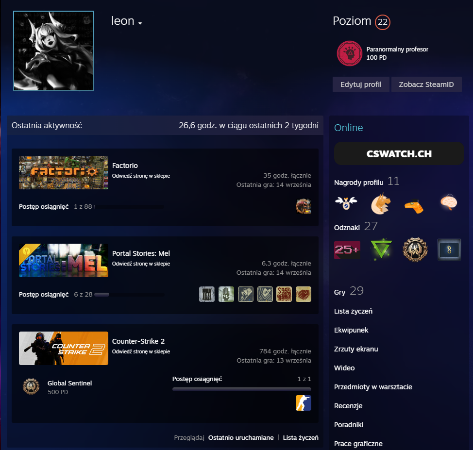
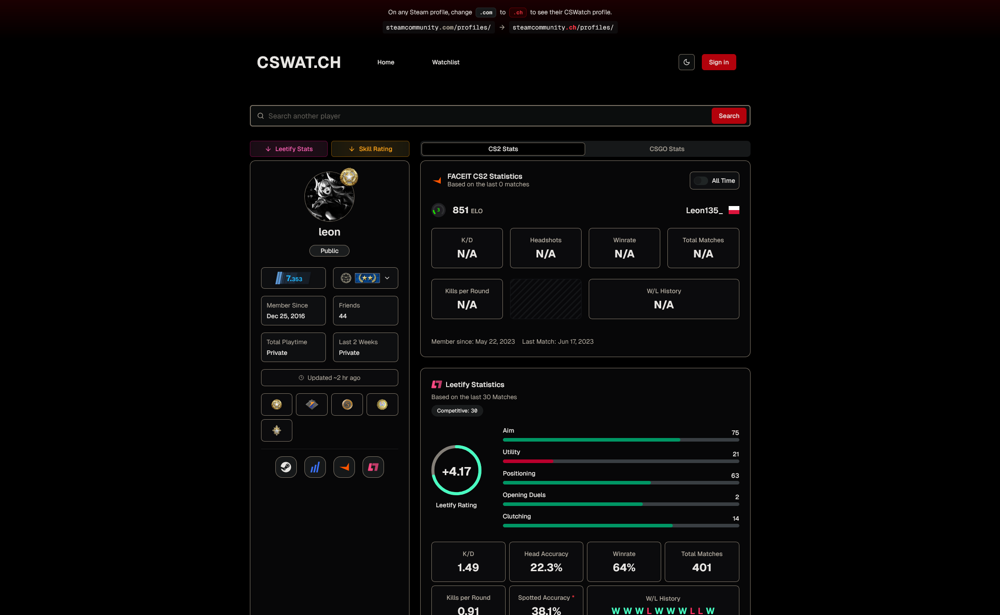

# CSWat.ch Plugin

This plugin adds a simple button under your Steam profile that redirects you to the [cswat.ch](https://cswat.ch) website.

It is based on the work of **@TOR968**—massive thanks to him for his contributions and inspiration!

## Prerequisites

- [Millennium](https://steambrew.app/)

## Links

- [GitHub repository](https://github.com/Leon135/cswatch-plugin/tree/main)
- [Steam Millenium plugin page](https://steambrew.app/plugin?id=c0f9737e4a5b)

## Screenshots

## Built with

- [Steam Millenium](https://github.com/SteamClientHomebrew/Millennium) - modding framework for Steam client
- [CSWatch](https://cswat.ch) - website with stats for CS2 players
- [Tor968's original plugin](https://github.com/TOR968/leetify-extension)

## License

This project is licensed under the MIT License. See [LICENSE](LICENSE) for details.

---

**Built with 💜 by [Leon135](https://leon135.xyz)**
